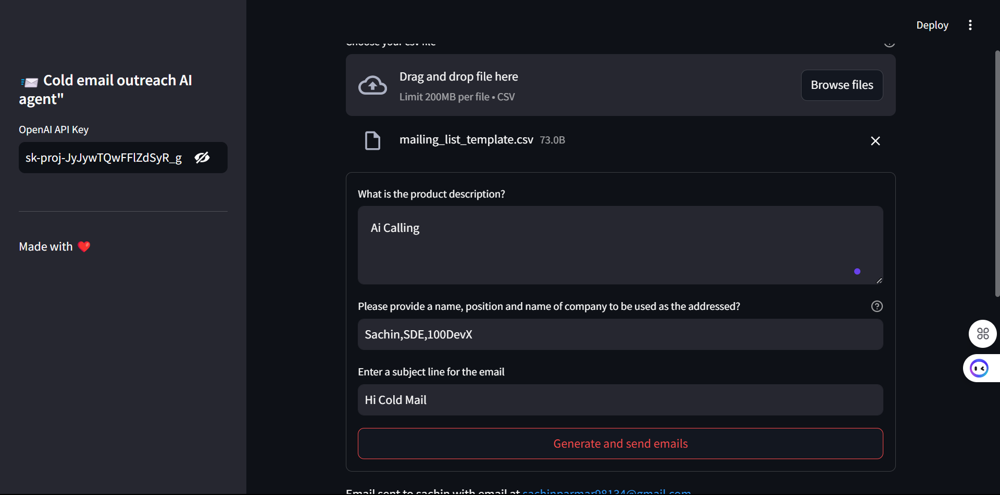
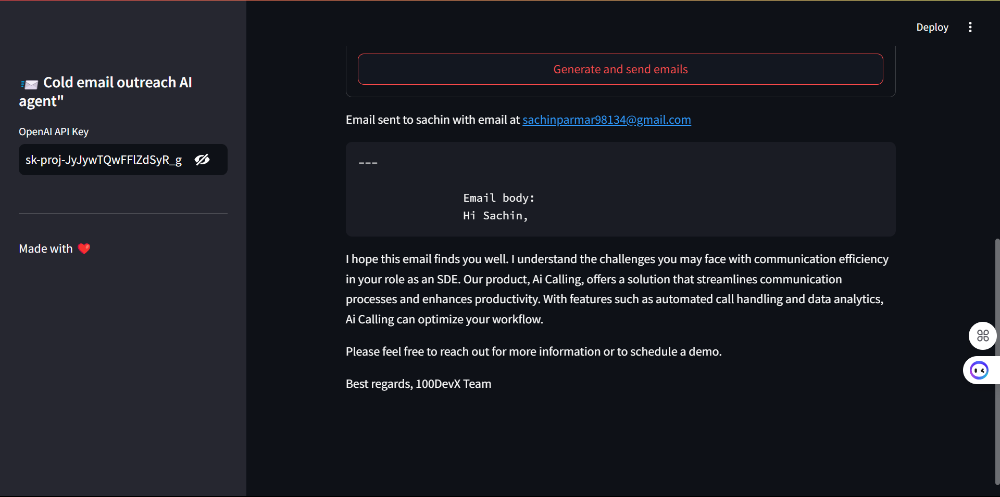
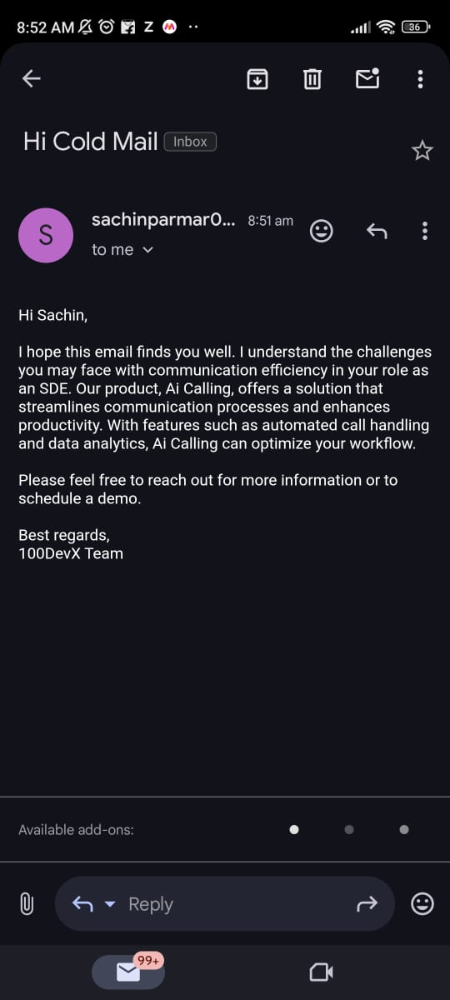

# SmartReach ColdMail 📨

  
  
<em>SmartReach's intuitive dashboard for campaign management</em>

  

    
    
<em>AI-powered email generation in action</em>

  

  

    
    
<em>Real-time campaign results and tracking</em>

  

## 🎯 What is SmartReach ColdMail?

SmartReach ColdMail is an AI-powered cold email automation tool that helps you:
- Generate personalized, engaging emails using OpenAI's language models
- Send bulk emails while maintaining a personal touch
- Track and manage your email campaigns efficiently
- Save time on cold email outreach

## ✨ Key Features

### 🤖 AI-Powered Email Generation
- Personalized content for each recipient
- Professional and engaging writing style
- Context-aware responses based on recipient data
- Consistent brand voice across all emails
- 100-word limit for optimal engagement

### 📧 Smart Email Management
- Bulk email processing via CSV
- Secure Gmail SMTP integration
- Real-time delivery tracking
- Error handling and reporting
- Campaign progress monitoring

### 🎨 User-Friendly Interface
- Simple CSV file upload
- Intuitive campaign setup
- Real-time email previews
- Easy-to-use form fields
- Clear status updates

## 🚀 Getting Started

### Prerequisites
1. Gmail account with 2FA enabled
2. OpenAI API key
3. Python 3.8 or higher
4. CSV file with recipient data

### Quick Setup
1. Configure environment variables
2. Set up Gmail authentication
3. Prepare your recipient CSV
4. Launch the application
5. Start your first campaign

## 📊 Campaign Process

### 1. Data Preparation
- Organize recipient information in CSV
- Include names, emails, and descriptions
- Verify data formatting
- Ensure email validity

### 2. Campaign Configuration
- Upload recipient CSV
- Enter product description
- Add sender information
- Set email subject line
- Review settings

### 3. Email Generation & Sending
- AI generates personalized content
- Preview generated emails
- Send test emails if needed
- Execute full campaign
- Monitor progress

## 💡 Best Practices

### Email Content
- Keep descriptions clear and concise
- Focus on recipient pain points
- Include clear call-to-action
- Maintain professional tone
- Personalize meaningfully

### Campaign Management
- Start with small test batches
- Monitor delivery rates
- Review AI-generated content
- Follow up strategically
- Track response rates

## 🎯 Use Cases

### Sales Teams
- Product launches
- Lead nurturing
- Market expansion
- Client reactivation
- Partnership development

### Business Development
- Market research
- Competitor analysis
- Partnership proposals
- Investment opportunities
- Vendor communications

### Recruitment
- Talent sourcing
- Candidate outreach
- Interview scheduling
- Follow-up communications
- Network building

## 📈 Future Enhancements

### Analytics Dashboard
- Open rate tracking
- Response analytics
- Success metrics
- Campaign comparison
- Performance insights

---

  
Made with ❤️ for cold email automation

  
© 2024 SmartReach ColdMail. All rights reserved.

